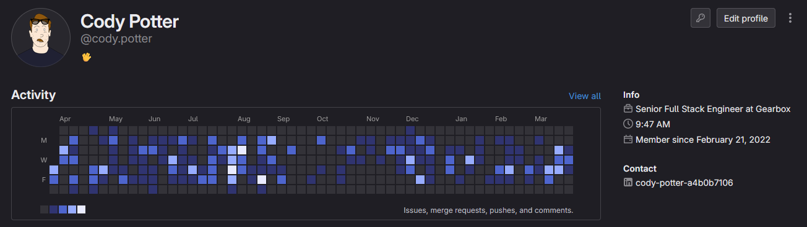

# Hi there, I'm Cody Potter! 👋

👨‍💻 Senior Full Stack Web Engineer at Gearbox  
📝 [Blog](https://www.loficode.com)  
🎥 [Youtube Channel](https://www.youtube.com/channel/UCsPXgrtO5bTfdVdNLLB_Erw)  
🛠️ [GitLab Profile](https://gitlab.com/cody.potter)  

## About Me

### My Work

I'm a passionate software engineer with a focus on full-stack web development. Currently, I work at Gearbox, where I build internal tools to moderate online services for game titles at scale. My expertise lies in Go and Angular, along with their associated toolchains. I have experience deploying and maintaining applications at scale in AWS.

### My Hobbies

I run a programming blog and a youtube channel known as *lofi***code**. There I focus on teaching others how to code in byte-size pieces.

## GitHub Contributions

While my day-to-day work primarily resides in [private repositories on GitLab](https://gitlab.com/cody.potter), I actively contribute to open-source projects on GitHub. Most of my contributions involve addressing bugs encountered during my work and sharing snippets of code to help improve the community's codebase.

## Projects

Here are some noteworthy projects I've been working on:

- [XCode Coverage Utility](https://github.com/codypotter/coverage-dashboard): A code coverage analyzer for your iOS project.
- [Itty Bitty Social](https://github.com/codypotter/itty-bitty-social): A very minimal backend example of how to set up your social networking backend in Go. This was used as an example in [this blog post](https://loficode.com/posts/go-layered-architecture).
- [Itty Bitty IRC](https://github.com/codypotter/itty-bitty-irc): This was a student project written in node.js to implment a minimal client and server application based on the IRC protocol.
- And a ton of private stuff I unfortunately cannot share.

## Education

| Institution                 | Location       | Degree/Certificate                  | GPA  | Completion Date |
| --------------------------- | -------------- | ----------------------------------- | ---- | --------------- |
| Portland State University   | Portland, OR   | Bachelor's Degree in Computer Science | 3.77 | June 2021      |
| Zero To Mastery Academy     | Remote         | React Developer Certificate         | N/A  | January 2022   |

## Professional Experience

| Company       | Location       | Role                          | Duration                  | Responsibilities |
| ------------- | -------------- | ----------------------------- | ------------------------- | ---------------- |
| Gearbox       | Frisco, TX (Remote) | Full Stack Software Engineer | January 2022 - Present    | Design, develop and maintain a highly scaled gift card redemption platform, a suite of moderation tools, as well as online game services at scale. Use technologies and languages such as Go, NodeJS, Angular, Rails, JavaScript, HTML, CSS, MySQL, Docker and more. Develop and troubleshoot with AWS services like RDS, S3, ECS, Cloudfront, Secrets Manager, AppConfig, API Gateway, Lambda, and more. |
| Self Employed | Portland, OR (Remote)  | Full Stack Web Bootcamp Tutor | October 2021 - February 2022 | Full time tutor for a University of Oregon Full Stack Web Development Bootcamp. Offer one on one in-depth coverage of concepts like Data Structures and Algorithms, Node.js and the MERN stack, Agile Methodologies, QA (unit testing), MySQL and MongoDB, Git/GitHub, JavaScript, jQuery, Bootstrap, JSON, AJAX, React.js, Python, Java, AWS, and much more. |
| QualityLogic  | Portland, OR (Remote)  | iOS Automation Engineer       | June 2021 - Present       | General maintenance of the UI test suite for MightyNetworks platform. Work with developers to assist them in writing testable code, and continuously integrate tests to prevent regressions during the startup's rapid feature development. |

## Get in Touch

Feel free to connect with me on:

- [LinkedIn](https://www.linkedin.com/in/cody-potter-a4b0b7106/)
- [Email](mailto:me@codypotter.com.com)

I'm always open to collaboration and discussing exciting opportunities!